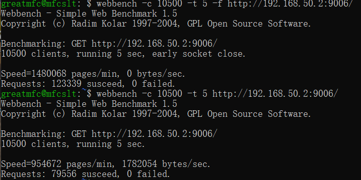
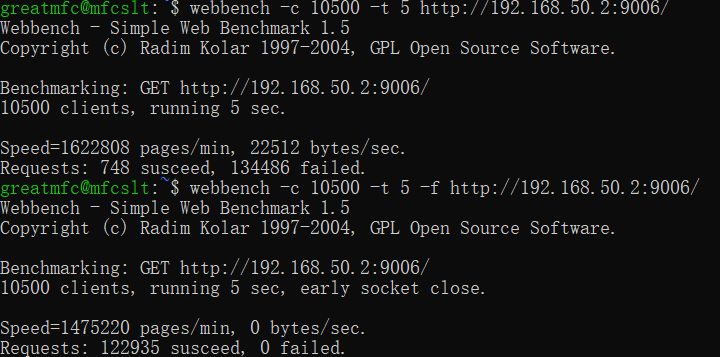

# TinyWebServer-with-liburing 介绍

## 简介

本项目是基于[TinyWebServer](https://github.com/qinguoyi/TinyWebServer)使用axboe封装的[liburing](https://github.com/axboe/liburing)库对项目中的epoll IO进行了替换和重写，实现了linux下的proactor+异步IO。

对liburing库的使用参考了该[io_uring-echo-server](https://github.com/frevib/io_uring-echo-server)的模型。

## 内容介绍

本项目重写的主要内容在iorws文件夹中，使用新增的iorws类在main.cpp文件中替换了原webserver类的event_Listen和event_Loop两个函数进行主进程的运行。

添加了-d选项，运行时参数为1可开启debug模式，会在终端上输出信息。

```
./server -d 1
```

取消了-m和-a选项，其他选项和原webserver保持一致。

可以使用make test命令对服务器运行状况进行检测，输出文件名为test。

```
make test
```

详细介绍见：iorws类细节介绍

[iorws类细节介绍]: ./iorws类细节介绍.md

## 已知问题

使用webbench进行压力测试会有大量的failed，并在测试后无法通过浏览器正常访问，需要结束进程重启，但不影响继续进行压力测试；

在wsl2上运行会出现无法分配内存的错误，需要使用sudo命令或root用户运行程序，虚拟机系统可正常运行。

## 性能对比

系统环境：wsl2，内核版本5.10.60.1，发行版为Debian

硬件：I5-9400

### 原webserver设置双ET+不开启日志



### 使用io_uring的webserver



由于优化问题，使用了`io_uring`的webserver在性能上与epoll相比略有优势，可以看得到`io_uring`在网络编程上的可行性和潜力所在。

## 线程版webbench

在test_presure文件夹下的Webbench文件夹中存有使用线程库重写的webbench，粗略估算相较原程序性能下降50%，CPU和内存占用减少50%。需使用g++进行编译。
